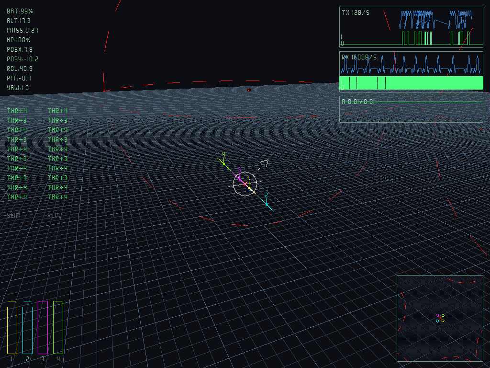
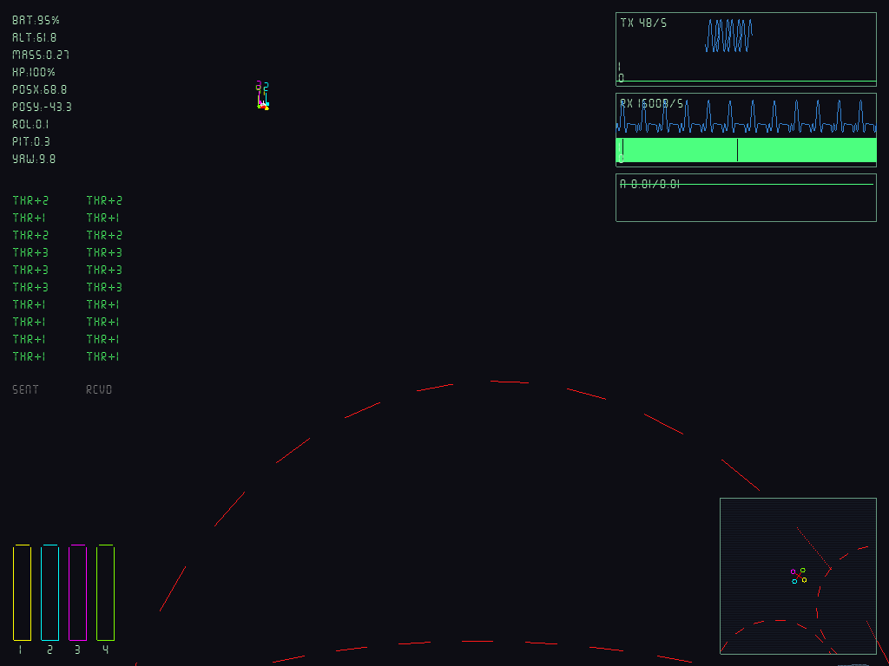
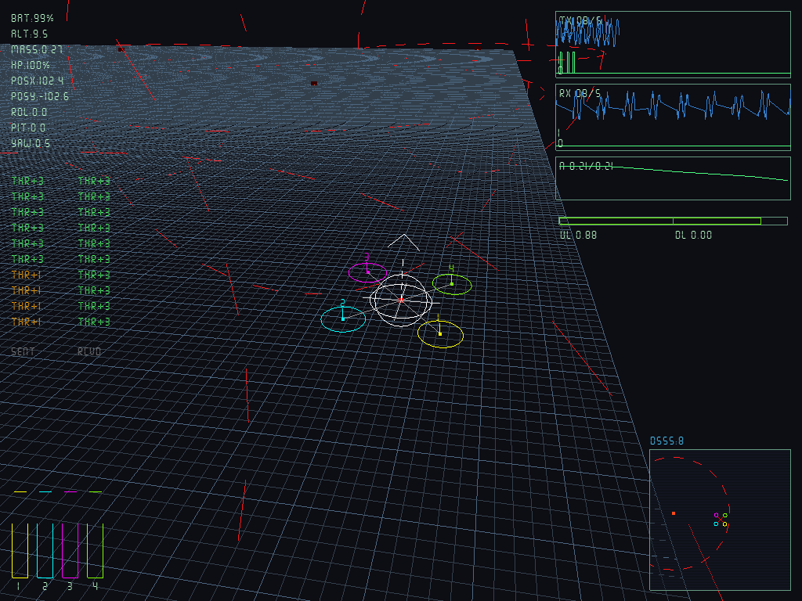
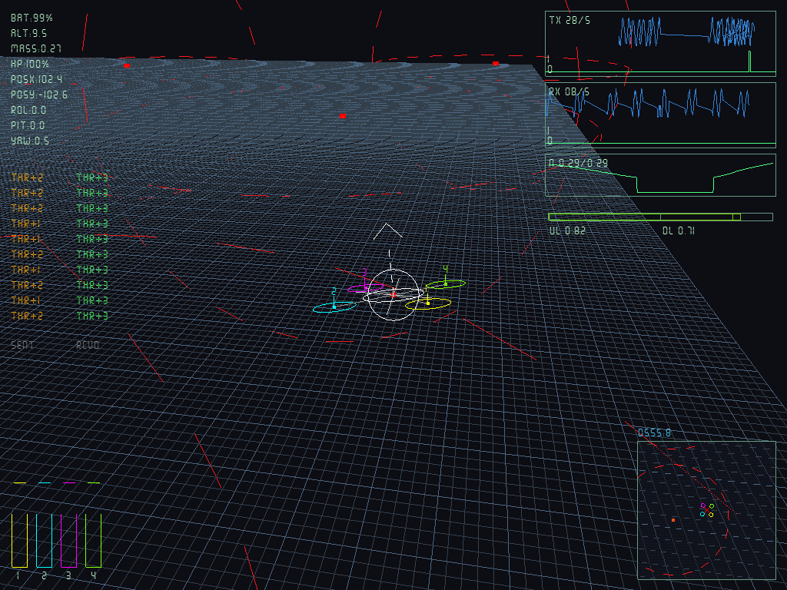
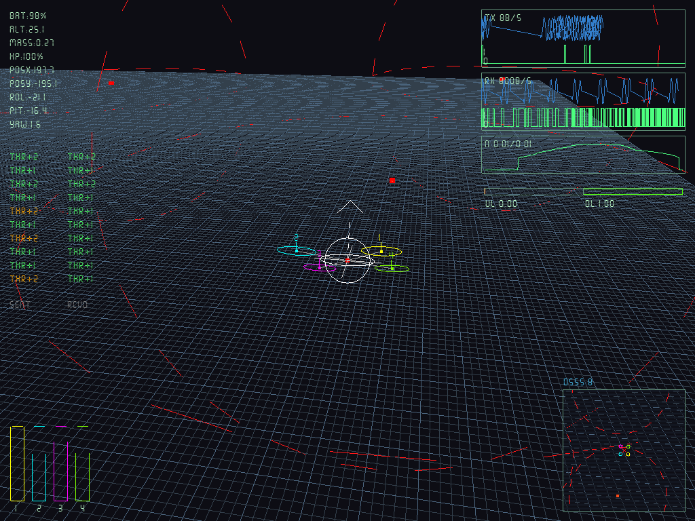

# UAVSIM

Python quadcopter (UAV) simulator. Real X-configuration 4-motor physics,
bit-encoded command/telemetry comms, free-world/follow camera, and an HUD
with live indicators + signal scopes — all rendered with OpenGL using only
points and lines (no textures, no external fonts).

None of the UAV's movement is explicitly scripted: thrust per motor is
computed, force/torque is integrated over a rigid body, and the resulting
motion (translation, pitch, roll, yaw) is an emergent outcome of that
physics.

## Gallery

| General view | Free camera |
|---|---|
|  |  |

| Approaching jammer | Inside jammer range | Leaving jammer |
|---|---|---|
|  |  |  |

## Installation

**1. GNU Radio** (not a pip package — install via your system package manager):

```bash
# Ubuntu/Debian
sudo apt-get install gnuradio

# Fedora
sudo dnf install gnuradio gnuradio-devel

# Arch
sudo pacman -S gnuradio

# macOS (Homebrew)
brew install gnuradio

# Cross-platform via conda:
conda install -c conda-forge gnuradio
```

Verify it's installed and importable from the Python you'll use:

```bash
python3 -c "from gnuradio import gr, blocks, digital, channels; print(gr.version())"
```

⚠️ **If you see `gr::vmcircbuf :error: shmat (2): Invalid argument` at runtime**:
GNU Radio's shared-memory vmcircbuf can fail on some systems. Set this env
var before running (or add it to your `~/.bashrc`):

```bash
export GR_SCHEDULER=STS
```

⚠️ **If you get a NumPy error like "compiled using NumPy 1.x cannot be run in NumPy 2.x"**:
your distro's GNU Radio was compiled against NumPy 1.x. Downgrade numpy in
that environment (`pip install "numpy<2" --force-reinstall`) — this is what
`requirements.txt` pins. This is a limitation of your system's GNU Radio
package, not of this project.

**2. Remaining dependencies with pip:**

```bash
python -m venv .venv
source .venv/bin/activate  # on Windows: .venv\Scripts\activate
pip install -r requirements.txt
```

If using a venv, make sure GNU Radio is visible from inside it (system
packages go to `/usr/lib/python3/dist-packages`, which venvs don't always
inherit — if the import fails only inside the venv, run `main.py` with the
system Python instead, or create the venv with `--system-site-packages`).

## Run

```bash
python main.py
```

## Controls

**Motors** — the drone is an X shape viewed from above, with 4 motors. Each
number key accelerates one motor; the letter directly above it (on QWERTY)
decelerates it gradually down to 0.

| Motor         | Accelerate | Decelerate |
|---------------|-----------|------------|
| Front-right   | `1`       | `Q`        |
| Back-right    | `2`       | `W`        |
| Back-left     | `3`       | `E`        |
| Front-left    | `4`       | `R`        |
| All 4         | `5`       | `T`        |

The UAV **starts parked on the ground, at rest**. If you don't give it
enough total thrust (all 4 motors combined exceeding its weight), it simply
stays there — no falling, no sinking. It only takes off when you, the
operator, give it enough thrust.

**Camera** (never first-person — always an external observer):

| Key          | Action |
|--------------|--------|
| Arrow keys   | FREE mode: move the camera. FOLLOW mode: orbit / zoom |
| Mouse        | Rotate view (orbit in FOLLOW, look around in FREE) |
| `V`          | Toggle between FOLLOW (chases the UAV, GTA-style) and FREE (spectator, fully free) |
| `BACKSPACE`  | Reset UAV + randomly reposition all jammers |
| `P`          | Pause / unpause (camera keeps working while paused) |
| `D`          | Toggle chaotic DSSS anti-jamming (N=8) on/off |
| `K`          | Save screenshot to `assets/images/` |
| `ESC`        | Quit |

When pressing `V` the camera doesn't "jump": it keeps the current viewpoint
and only changes how it's controlled from there onward.

## HUD

Everything the HUD shows comes from the signal the UAV periodically
transmits (or from the channels' own statistics), never from reading the UAV
directly — the `HUD` only talks to the `UAVOperator`.

- **Battery** (`BAT`, %) — drains faster the more total thrust the motors use.
- **Altitude** (`ALT`, meters).
- **Health** (`HP`, %) — decreases on hard landings (vertical impact
  velocity > 3 m/s). At 0% the UAV is dead: motors stop, no commands are
  processed, physics still applies (gravity). Damage also reduces effective
  max thrust linearly down to 50% at 0 HP.
- **Drone attitude** (`ROL`/`PIT`/`YAW`, degrees) — roll, pitch, yaw.
- **Horizontal position** (`POSX`/`POSY`, meters).
- **Mass** (`MASS`, kg) — total mass = body + 4 motors, treated as a single
  point mass for physics (each motor's separate inertia is not modeled).
- **Command log** — last 10 commands received by the UAV, shown below the
  telemetry readout. Valid commands appear in green, corrupted ones in red.
- **Minimap** (bottom-right) — top-down view (200×200 world-units) with the
  UAV icon at centre (coloured motor circles + X rotated by yaw) and jammer
  positions with their effect-range circles, clipped to the minimap border.
- **Bandwidth** — two oscilloscope-style panels: `TX` (uplink:
  Operator → UAV, commands) and `RX` (downlink: UAV → Operator, telemetry).
  Each panel shows a **single channel** (no multi-channel): bandwidth in
  bytes/sec and, drawn as a real NRZ square wave, the actual signal the
  `CommGatewayOutput` encoded and transmitted bit by bit — not a decorative
  animation, these are the real bits of each message.
- **Noise timeline** — real-time graph of uplink (TX) and downlink (RX) noise
  voltage below the signal panels, updated every frame.
- **DSSS correlation meter** — when anti-jamming is active (`D` key), a
  horizontal bar shows per-burst correlation quality (green = good, red =
  jammed) for both links, with a `DSSS:N` label above the minimap.
- Per-motor throttle bars at the bottom, as before.

All HUD text (letters, numbers, `%`, `:`, etc.) is drawn with a TrueType
texture atlas (`rendering/ttf_font.py`) via a 7-segment TTF font.

## Communication: Real GNU Radio, not an in-memory queue

The Operator and the UAV are each other's transmitter and receiver (the
Operator transmits commands, the UAV transmits telemetry), and **the signal
between them actually travels through GNU Radio**: real GMSK modulation, a
simulated AWGN channel (`channels.channel_model`), real demodulation, and
access-code synchronization (`digital.correlate_access_code_tag_bb`). This
is not a Python queue pretending to be a radio.

Each direction (`command_link`, `telemetry_link`) is an independent
`GnuRadioChannel` with its own background thread:

```
send(bytes) -> [preamble + access code + payload + CRC32 + tail padding]
             -> digital.gmsk_mod (real modulation)
             -> channels.channel_model (simulated AWGN noise)
             -> digital.gmsk_demod (real demodulation)
             -> digital.correlate_access_code_tag_bb (real sync)
             -> CRC32 verification
             -> recovered bytes (or the packet is lost, just like a real radio)
```

Real consequences, not cosmetic:

- **Packets can be lost or corrupted**: with low noise (default
  `noise_voltage=0.05`) almost everything arrives intact, but it's a real
  radio, not a guarantee. If the access code doesn't sync or CRC32 fails,
  the packet is dropped — corrupted data is never delivered to the app
  (`UAV`/`Operator` silently ignore corrupt packets, they don't crash).
- **Delivery is asynchronous with real jitter**: each burst (encode +
  modulate + pass through the channel + demodulate) costs ~10ms of real CPU
  time, so it runs in a background thread per channel, never blocking the
  main loop. That's why the `UAVOperator` doesn't send one command per frame:
  it retransmits each (motor, direction) combination at a max of 20 Hz
  (`COMMAND_SEND_INTERVAL`), just like a real RC transmitter, well below the
  measured ~100 bursts/sec per thread ceiling.
- **Throttle no longer depends on `dt`**: since commands arrive async and
  with jitter (not a perfect once-per-frame tick as before), each `Motor`
  now bumps up/down by a fixed step (`throttle_step_up`/`throttle_step_down`)
  per received command, rather than a rate multiplied by `dt`.
- **A bit of aerodynamic drag appears** (`RigidBody.linear_drag_coefficient`
  / `angular_drag_coefficient`): with perfectly synchronous delivery all 4
  motors always rose at exactly the same rate and there was never any yaw
  from asymmetry. With a real radio, jitter between motors is real (one may
  arrive a few ms before another), and without any drag that accumulated
  into unbounded spin. Drag is passive physics (it resists existing
  velocity/spin, never pushes toward a target attitude) — it's not
  auto-stabilization or a flight controller.

## Architecture

```
uavsim/
├── comms/
│   ├── command.py         Command + CommandOpcode: 1-byte protocol
│   ├── telemetry.py       TelemetryPacket: binary struct (battery + mass + health + command log)
│   ├── gnuradio_link.py   GnuRadioChannel: real radio link (GMSK +
│   │                      noisy channel + demod + CRC), with its own
│   │                      background thread
│   ├── comm_chaos_adapter.py DSSSChaotic + Lorenz-based spread/despread
│   └── gateway.py          CommGatewayInput/Output: wrap a
│                            GnuRadioChannel: Output sees TX traffic
│                            (transmitted), Input sees RX traffic (actually
│                            received, with losses already applied)
├── physics/
│   ├── motor.py           Motor: throttle -> thrust + reaction torque
│   │                      (fixed step per command, no longer per-dt)
│   ├── battery.py         Battery: drains based on motor usage
│   └── rigid_body.py      RigidBody: generic 6DOF (numpy + scipy Rotation)
│                           + linear/angular aerodynamic drag
├── world/
│   └── environment.py     World / FlatGroundPlane + apply_ground_contact()
│                          (UAV doesn't clip through the floor; takes off
│                          only when thrust is sufficient)
├── entities/
│   ├── uav.py             UAV: 4 motors in X config, total mass, battery,
│   │                      applies commands, runs physics + ground contact +
│   │                      crash detection + health/damage, emits periodic
│   │                      telemetry
│   └── operator.py        UAVOperator: keys -> Command, rate-limited to
│                          20 Hz per (motor, direction) to CommGatewayOutput
├── hud/
│   └── hud.py             HUD: telemetry + bandwidth + raw signal + command
│                          log, all read from the Operator
└── rendering/
    ├── window.py           Window + unified input (motors, arrows,
    │                       mouse, camera toggle, reset) via pygame
    ├── camera.py           Camera: FOLLOW (orbit) and FREE (spectator) modes
    ├── ttf_font.py          TrueType texture atlas font renderer
    └── renderer.py         Draws terrain + UAV + full HUD
```

### Why the camera bug happened (historical)

Before, the UAV had no ground collision: it fell in free fall from frame 1
(gravity with nothing to stop it), and the camera was attached with a fixed
offset to the UAV's position. In a couple of seconds the drone fell so far
it exited the perspective far clipping plane → the screen turned to the
background color (near black). That also made the HUD appear "absent": the
scene broke almost instantly.

Now `apply_ground_contact()` stops the UAV at the floor until its own thrust
lifts it, and the camera never depends on the UAV's orientation (only its
position), so even if the drone tumbles from asymmetric thrust, the camera
doesn't "go crazy" with it.

### Design decisions

- **Real bit-level protocol**: `Command.encode()`/`decode()` pack each order
  into a real 1-byte packet, and the UAV decodes it via `CommGatewayInput`.
- **Telemetry with `struct`**: binary pack/unpack using the standard library.
- **Physics with `numpy` + `scipy.spatial.transform.Rotation`**: scipy
  quaternions instead of hand-rolled rotation matrices.
- **Strict layer separation**: `RigidBody` doesn't know what a motor or
  ground is; `Motor` doesn't know what a UAV is; `UAV` doesn't know about
  keyboards or cameras; `HUD` never talks to the UAV, only to what the
  `Operator` has already received; `Camera` knows nothing about physics or
  comms.

## References

The chaotic DSSS anti-jamming scheme implemented here is based on the
following papers (PDFs available in `docs/`):

1. **Souli, N.**, Stavrinides, S. G., Picos, R., Karatzia, M., Kolios, P.,
   & Ellinas, G. (2025). *Development of a Lightweight Secure Communication
   System for UAVs Enhanced by an Unconventional Chaotic Communication
   Architecture*. Journal of Intelligent & Robotic Systems, 111(3), 85.
   [DOI: 10.1007/s10846-025-02293-6](https://doi.org/10.1007/s10846-025-02293-6)

2. **Nwachioma, C.**, Ezuma, M., & Medaiyese, O. O. (2021). *FPGA
   prototyping of synchronized chaotic map for UAV secure communication*.
   2021 IEEE Aerospace Conference, 1–7.
   [DOI: 10.1109/AERO50100.2021.9438428](https://doi.org/10.1109/AERO50100.2021.9438428)

## Next steps (not yet implemented)

- ~~Jammers~~ ✅ done — orange-red cylinders with dotted range circles that
  raise the noise floor on both radio links. Randomly placed at startup,
  repositioned on reset. The minimap shows their positions and range.
- Non-flat terrain.
- More realistic ground contact (real normal force instead of clamping).
